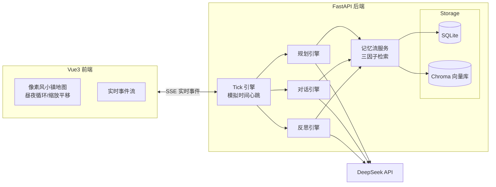

# MapleTown 枫叶镇 · AI 小镇观测站

> A full-stack AI project that replicates and productizes the Stanford paper *"Generative Agents: Interactive Simulacra of Human Behavior"*.
> 一群拥有记忆、会反思、能自主规划日程的 AI 居民生活在枫叶镇——而你是观察者、访谈者与导演。

## 项目简介

枫叶镇是一个运行在浏览器里的多智能体 AI 小镇：

- **10 位 AI 居民**，各有职业、性格与背景故事（咖啡馆老板、退隐律师、图书管理员、小学教师、面包师……）
- **每 3 秒推进一次模拟心跳**（1 tick = 10 分钟小镇时间），居民自主决定去哪、做什么、和谁聊天
- 对话、决策、总结全部由 **DeepSeek LLM 实时生成**，没有任何写死的剧本
- 前端以 **16-bit 像素风小镇地图** 呈现：14 个地点、昼夜光照循环、实时小人走位

## 核心机制：论文 → 工程实现

本项目完整落地了 Generative Agents 论文的认知架构：

| 论文机制 | 工程实现 |
|---|---|
| Memory Stream 记忆流 | 每次观察/对话/反思写入 SQLite + 向量化入库 Chroma |
| 三因子检索 | `score = α·recency + β·importance + γ·relevance`，recency 按小时指数衰减（0.995/h），importance 由 LLM 打分 1-10，relevance 用 bge-small-zh 嵌入余弦相似度 |
| Retrieval 候选集 | 向量库 top-32 相关结果 ∪ 最近 3 条记忆，防止新记忆被漏检 |
| Reflection 反思 | 重要性分数累积 ≥120 触发；两步管线：生成问题 → 检索证据 → 合成洞察；产出带 `source_memory_ids` 的高层洞察并回流记忆流，形成反思树（反思可以嵌套反思） |
| Planning 规划 | 清晨（模拟 07:00 后）为居民生成全天日程；错峰处理（每 tick 最多 3 人）；支持 replan 与决策注入 |
| Dialogue 对话 | 同一地点居民相遇即可能开聊；每 tick ≤2 组对话、单次 ≤8 轮、话题枯竭自动终止；结束后生成双视角总结并更新亲密度（±0.15 钳位） |

### LLM 成本工程（面试加分项）

- **并发限流**：全局信号量控制同时 5 个 LLM 请求，超时 90s
- **每日预算熔断**：token 用量落库（`token_usage` 表），超过日预算自动暂停引擎
- **嵌入降级**：fastembed 本地模型优先，失败时回退 hash embedding，保证系统不因嵌入服务挂掉而停摆

## 系统架构



## 技术栈

**后端**：Python 3.12+ · FastAPI · SQLAlchemy 2.0 · SQLite · ChromaDB · fastembed（bge-small-zh 中文嵌入） · OpenAI SDK（DeepSeek 兼容接口） · SSE（sse-starlette）

**前端**：Vue 3 · Vite · Pinia · Element Plus · 程序化 SVG 像素画（320×200 画布逐像素绘制）

**工程化**：pytest 单元测试（38 个用例，覆盖记忆检索/规划/对话/反思四大引擎） · 环境变量配置管理 · 增量数据库迁移

## 快速开始

### 1. 准备

- Python 3.12+，Node.js 18+
- 一个 [DeepSeek API Key](https://platform.deepseek.com/)

### 2. 启动后端

```bash
cd mapletown/backend
python -m venv .venv
.venv\Scripts\activate          # Windows；macOS/Linux 用 source .venv/bin/activate
pip install -r requirements.txt
copy .env.example .env           # macOS/Linux 用 cp
# 编辑 .env，填入 DEEPSEEK_API_KEY=sk-xxx
uvicorn app.main:app --port 8000
```

启动后访问 `http://localhost:8000/docs` 查看 API 文档，`http://localhost:8000` 返回状态 JSON 即成功。

### 3. 启动前端

```bash
cd mapletown/frontend
npm install
npm run dev
```

打开终端提示的地址（默认 `http://localhost:5173`），注册账号登录后即可看到小镇全景。

## 项目结构

```
mapletown/
├── backend/
│   ├── app/
│   │   ├── api/routes/        # REST + SSE 路由（居民/对话/事件/模拟控制）
│   │   ├── cognition/         # 认知核心：记忆流、提示词、嵌入、向量库
│   │   ├── engine/            # 模拟引擎：tick 心跳、规划、对话、反思、种子数据
│   │   ├── llm/                # DeepSeek 客户端（并发/超时/用量统计）
│   │   ├── models/            # SQLAlchemy 模型
│   │   └── services/          # 事件总线、事件落库
│   └── tests/                 # pytest：记忆检索/规划/对话/反思/API
├── frontend/
│   └── src/
│       ├── views/             # 登录页、小镇全景页
│       ├── components/        # 像素风 TownMap、事件流、Logo
│       ├── stores/            # Pinia：SSE 订阅与状态管理
│       └── api/               # 后端接口封装
└── docs/                      # 项目规划与 M3 架构设计文档
```

## API 一览（前缀 `/api/v1`）

| 接口 | 说明 |
|---|---|
| `GET /residents` / `GET /residents/{id}` | 居民列表与详情（状态/位置/亲密度） |
| `GET /residents/{id}/memories` | 记忆流浏览 |
| `GET /residents/{id}/memory-search?q=` | 三因子检索演示（带打分明细） |
| `GET /residents/{id}/plan` | 当日日程 |
| `GET /residents/{id}/reflections?limit=` | 反思链（支持反思树回溯） |
| `GET /conversations` / `GET /conversations/{id}` | 对话列表与逐轮详情 |
| `GET /events` + `GET /events/stream/feed` | 历史事件 + SSE 实时事件流 |
| `GET /sim/state` + `POST /sim/control` | 模拟状态查询与控制（启停/倍速） |

## 测试

```bash
cd mapletown/backend
pytest -v
```

38 个用例覆盖：记忆三因子检索打分、规划生成与补规划、对话生命周期与总结、反思触发与合成、核心 API 契约。

## 开发路线图

- [x] M1 后端骨架 + DeepSeek 连通性验证
- [x] M2 认知核心：记忆流 + 三因子检索 + 向量库
- [x] M3 自主智能：规划引擎 / 对话引擎 / 反思引擎
- [x] M4 前端：登录 / 像素风小镇全景 / SSE 实时事件
- [ ] M5 观测产品化：居民详情、记忆观测器、空降对话、社交图谱
- [ ] M6 收尾：小镇日报、导演模式、仪表盘

## 参考

- [Generative Agents: Interactive Simulacra of Human Behavior](https://arxiv.org/abs/2304.03442)（Park et al., 2023）
- [DeepSeek API](https://platform.deepseek.com/)
